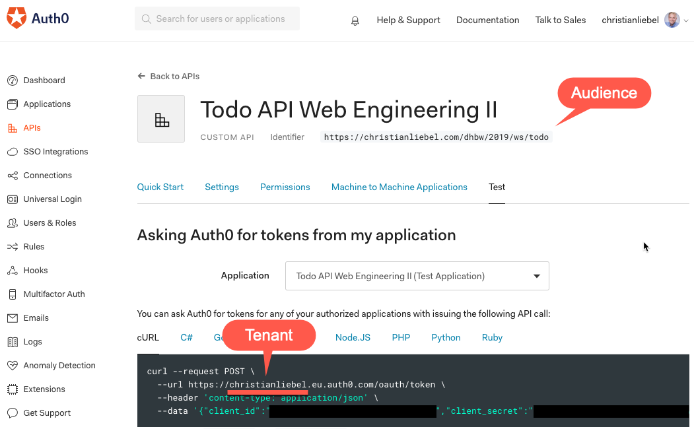

# TINF18: Web Engineering II

Quellcode des Demo-Backends für die Vorlesung Web Engineering II, Jahrgang TINF18 an der Dualen Hochschule Baden-Württemberg Karlsruhe.

## Setup
```bash
npm i
npm start
```

Please adjust (the JWT configuration)[https://github.com/christianliebel/dhbw-webeng2-ws2019-server/blob/master/src/common/authentication.middleware.ts#L12-L16] to match your tenant & audience from Auth0.


